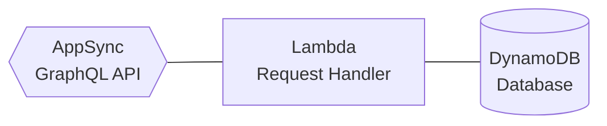

# Homunculonimbus

Homunculonimbus is an **experimental** graph database service.

## Features

- Labeled property graphs (LPGs)
- GraphQL API
- Multi-region and serverless
- Independently scalable compute and storage

## Name

Homunculonimbus is a portmanteau of _homunculus_ and _cumulonimbus_.

## Service Architecture



Clients interact with data via an AppSync GraphQL API.

Requests are handled by a Lambda function with read and write access to a DynamoDB database.

## Query Language

Clients model requests using GraphQL.

### Mutations

Homunculonimbus provides two mutations: `create` and `delete`.

#### The `create` mutation

The `create` mutation allows clients to create edges, features, and nodes.

##### Examples

###### Create a node

This mutation creates a node from an empty object (`{}`) and returns the `id` of the newly created node.

```graphql
mutation {
	create(
		nodes: {
			from: [
				{}
			]
		}
	) {
		created {
			nodes {
				enumerate {
					id
				}
			}
		}
	}
}
```

###### Create two nodes joined by an edge

This mutation creates an edge and two nodes.
Each of the two nodes is created from an empty object (`{}`).
The edge is created from the two newly-created nodes.

The `id` values of the newly-created edge and the two newly-created nodes are returned.

```graphql
mutation {
	create(
		edges: {
			from: [
				{
					nodes: {
						destination: {}
						origin: {}
					}
				}
			]
		}
	) {
		created {
			edges {
				enumerate {
					id
				}
			}
			nodes {
				enumerate {
					id
				}
			}
		}
	}
}
```

###### Create a node with a `userId` feature

This mutation creates a node and a feature.
The feature is created from a key and a value (`{key: "userId", value: "ABC123"}`).
The node is created from the newly created feature.

The `id` of the newly creatd node is returned, along with the `values` of all node-features with a `userId` key.

```graphql
mutation createNodeWithUserIdABC123 {
	create(
		nodes: {
			from: [
				{
					features: {
						from: [
							{
								key: "userId"
								value: "ABC123"
							}
						]
					}
				}
			]
		}
	) {
		created {
			nodes {
				enumerate {
					id
					features(
						select: {
							where: {
								key: {
									equals: "userId"
								}
							}
						}
					) {
						enumerate {
							key
							value
						}
					}
				}
			}
		}
	}
}
```

#### The `delete` mutation

The `delete` mutation allows clients to delete edges, features, and nodes.

##### Examples

###### Delete a feature by `id`

This mutation deletes a feature by the given `id`.

The `id` of the deleted feature is returned.

```graphql
mutation deleteFeatureByFeatureId($featureId: String!) {
	delete(
		features: {
			where: {
				id: {
					equals: $featureId
				}
			}
		}
	) {
		deleted {
			features {
				enumerate {
					id
				}
			}
		}
	}
}
```

###### Delete all features with a `userId` key

This mutation deletes all features that have a `userId` key.

The `id` values of the deleted features are returned.

```graphql
mutation {
	delete(
		features: {
			where: {
				key: {
					equals: "userId"
				}
			}
		}
	) {
		deleted {
			features {
				enumerate {
					id
				}
			}
		}
	}
}
```

###### Delete an edge and any related features

This mutation deletes an edge and any related features by the given `edgeId`.

The `id` values of any deleted edges or features are returned.

```graphql
mutation deleteEdgeAndFeaturesByEdgeId($edgeId: String!) {
	delete(
		edges: {
			where: {
				id: {
					equals: $edgeId
				}
			}
		}
	) {
		deleted {
			edges {
				enumerate {
					id
				}
			}
			features {
				enumerate {
					id
				}
			}
		}
	}
}
```

###### Delete the top five scores

This mutation deletes the top five scores.

The sum of the deleted scores is returned.

```graphql
mutation {
	delete(
		features: {
			where: {
				key: {
					equals: "score"
				}
			}
			by: {
				value: {
					asFloat: largestToSmallest
				}
			}
			limit: 5
		}
	) {
		deleted {
			features {
				calculate {
					value {
						asFloat {
							total
						}
					}
				}
			}
		}
	}
}
```

### Queries

Homunculonimbus provides queries for three resource types: `edges`, `features`, and `nodes`.

#### The `edges` query

The `edges` query allows clients to query edges, as well as related features and nodes.

##### Examples

###### Get feature `id` values by `edgeId`

This query finds edges with the given `edgeId`.

The `id` values of the features attached to the edge are returned.

```graphql
query getFeatureIdsByEdgeId($edgeId: String!) {
	edges(
		select: {
			where: {
				id: {
					equals: $edgeId
				}
			}
		}
	) {
		enumerate {
			features {
				enumerate {
					id
				}
			}
		}
	}
}
```

#### The `features` query

The `features` query allows clients to query features, as well as related edges and nodes.

##### Examples

###### Get high score

This query finds features with a `"score"` key.

The maximum `value` of the features is returned.

```graphql
query {
	features(
		select: {
			where: {
				key: {
					equals: "score"
				}
			}
		}
	) {
		calculate {
			value {
				asFloat {
					maximum
				}
			}
		}
	}
}
```

#### The `nodes` query

The `nodes` query allows clients to query nodes, as well as related features and edges.

##### Examples

###### Get neighboring node feature values by `nodeId`

This query finds nodes with the given `nodeId`.

The values of the features of the node are returned.

```graphql
query getNeighboringNodeFeatureValuesByNodeId($nodeId: String!) {
	nodes(
		select: {
			where: {
				id: {
					equals: $nodeId
				}
			}
		}
	) {
		enumerate {
			features {
				enumerate {
					value
				}
			}
		}
	}
}
```

## Database Strategy

Data is stored in DynamoDB in accordance with the single-table design paradigm.

Every record is guaranteed to have two attributes: `PK` and `SK`.

Every `PK` and `SK` attribute value comprises three parts:

1. A type signifier (e.g. `e` for "edge", `n` for "node", and `f` for "feature")
2. A delimiting character (`#`)
3. An instance identifier (`030702ca-97f6-4611-b43a-d305f5a964e7`)

Feature records have two additional attributes: `Key` and `Value`.

### Indexing Strategy

Data is organized into three indices.

#### The primary index

The primary index provides access to the following record types via a combination of the `PK` and `SK` attributes

- Node
- NodeEdge
- NodeFeature
- Edge
- EdgeFeature
- Feature

#### The inverted index

The "inverted" global secondary index (GSI) provides access to the following record types via a combination of the `SK`
and `PK` attributes

- EdgeNode
- FeatureNode
- FeatureEdge

#### The sparse index

The "sparse" GSI provides access to the following record types via the `Key` attribute

- Feature

