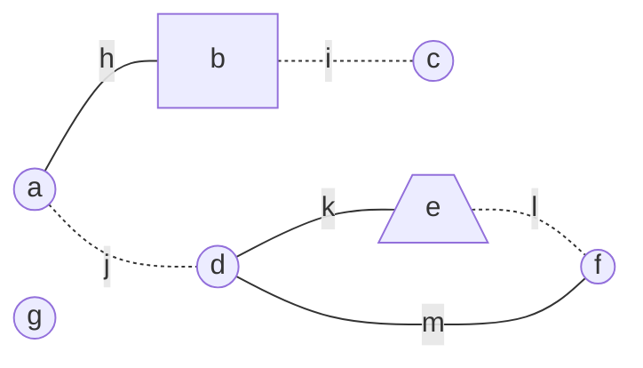

# Homunculonimbus

Homunculonimbus is an **experimental** serverless graph database service.

## Example

In this example, we'll view a single set of data from two different perspectives.

### Diagram View

The first perspective is graphical: a diagram of a node network.

### Table View

The second perspective is less human-readable: a table of records representing the nodes, edges, and features of the
same node network diagrammed above.

<table>
	<tr>
		<th>PK</th>
		<th>SK</th>
		<th>FK</th>
		<th>FV</th>
	</tr>
	<tr>
		<td>n#a</td>
		<td>n#a</td>
		<td></td>
		<td></td>
	</tr>
	<tr>
		<td>n#b</td>
		<td>n#b</td>
		<td></td>
		<td></td>
	</tr>
	<tr>
		<td>n#c</td>
		<td>n#c</td>
		<td></td>
		<td></td>
	</tr>
	<tr>
		<td>n#d</td>
		<td>n#d</td>
		<td></td>
		<td></td>
	</tr>
	<tr>
		<td>n#e</td>
		<td>n#e</td>
		<td></td>
		<td></td>
	</tr>
	<tr>
		<td>n#f</td>
		<td>n#f</td>
		<td></td>
		<td></td>
	</tr>
	<tr>
		<td>n#g</td>
		<td>n#g</td>
		<td></td>
		<td></td>
	</tr><tr>
		<td>n#a</td>
		<td>e#h</td>
		<td></td>
		<td></td>
	</tr>
	<tr>
		<td>n#b</td>
		<td>e#h</td>
		<td></td>
		<td></td>
	</tr>
	<tr>
		<td>n#b</td>
		<td>e#i</td>
		<td></td>
		<td></td>
	</tr>
	<tr>
		<td>n#c</td>
		<td>e#i</td>
		<td></td>
		<td></td>
	</tr>
	<tr>
		<td>n#d</td>
		<td>n#j</td>
		<td></td>
		<td></td>
	</tr>
	<tr>
		<td>n#d</td>
		<td>n#k</td>
		<td></td>
		<td></td>
	</tr>
	<tr>
		<td>n#d</td>
		<td>n#m</td>
		<td></td>
		<td></td>
	</tr>
	<tr>
		<td>n#e</td>
		<td>e#k</td>
		<td></td>
		<td></td>
	</tr>
	<tr>
		<td>n#e</td>
		<td>e#l</td>
		<td></td>
		<td></td>
	</tr>
	<tr>
		<td>n#f</td>
		<td>e#l</td>
		<td></td>
		<td></td>
	</tr>
	<tr>
		<td>n#f</td>
		<td>e#m</td>
		<td></td>
		<td></td>
	</tr>
	<tr>
		<td>n#b</td>
		<td>f#n</td>
		<td></td>
		<td></td>
	</tr>
	<tr>
		<td>n#e</td>
		<td>f#o</td>
		<td></td>
		<td></td>
	</tr>
	<tr>
		<td>e#h</td>
		<td>e#h</td>
		<td></td>
		<td></td>
	</tr>
	<tr>
		<td>e#i</td>
		<td>e#i</td>
		<td></td>
		<td></td>
	</tr>
	<tr>
		<td>e#j</td>
		<td>e#j</td>
		<td></td>
		<td></td>
	</tr>
	<tr>
		<td>e#k</td>
		<td>e#k</td>
		<td></td>
		<td></td>
	</tr>
	<tr>
		<td>e#l</td>
		<td>e#l</td>
		<td></td>
		<td></td>
	</tr>
	<tr>
		<td>e#m</td>
		<td>e#m</td>
		<td></td>
		<td></td>
	</tr>
	<tr>
		<td>e#i</td>
		<td>f#p</td>
		<td></td>
		<td></td>
	</tr>
	<tr>
		<td>e#j</td>
		<td>f#p</td>
		<td></td>
		<td></td>
	</tr>
	<tr>
		<td>e#l</td>
		<td>f#p</td>
		<td></td>
		<td></td>
	</tr>
	<tr>
		<td>f#n</td>
		<td>f#n</td>
		<td>shape</td>
		<td>square</td>
	</tr>
	<tr>
		<td>f#o</td>
		<td>f#o</td>
		<td>shape</td>
		<td>trapezoid</td>
	</tr>
	<tr>
		<td>f#p</td>
		<td>f#p</td>
		<td>isDotted</td>
		<td>true</td>
	</tr>
</table>

## DynamoDB Access Patterns

### Primary Index

<table>
	<tr>
		<th></th>
		<th>Primary Key</th>
		<th>Secondary Key</th>
	</tr>
	<tr>
		<td>Node</td>
		<td>n#[NODE_ID]</td>
		<td>n#[NODE_ID]</td>
	</tr>
	<tr>
		<td>NodeEdge</td>
		<td>n#[NODE_ID]</td>
		<td>e#[EDGE_ID]</td>
	</tr>
	<tr>
		<td>NodeFeature</td>
		<td>n#[NODE_ID]</td>
		<td>f#[FEATURE_ID]</td>
	</tr>
	<tr>
		<td>Edge</td>
		<td>e#[EDGE_ID]</td>
		<td>e#[EDGE_ID]</td>
	</tr>
	<tr>
		<td>EdgeFeature</td>
		<td>e#[EDGE_ID]</td>
		<td>f#[FEATURE_ID]</td>
	</tr>
	<tr>
		<td>Feature</td>
		<td>f#[FEATURE_ID]</td>
		<td>f#[FEATURE_ID]</td>
	</tr>
</table>

### Secondary Index (Inverted Index)

<table>
	<tr>
		<th></th>
		<th>Primary Key</th>
		<th>Secondary Key</th>
	</tr>
	<tr>
		<td>EdgeNode</td>
		<td>e#[EDGE_ID]</td>
		<td>n#[NODE_ID]</td>
	</tr>
	<tr>
		<td>FeatureNode</td>
		<td>f#[FEATURE_ID]</td>
		<td>n#[NODE_ID]</td>
	</tr>
	<tr>
		<td>FeatureEdge</td>
		<td>f#[FEATURE_ID]</td>
		<td>e#[EDGE_ID]</td>
	</tr>
</table>

## API

- Node
	- CREATE
	- DELETE where PK equals "n#NODE_ID"
- Edge
	- CREATE from [NODE_ID, NODE_ID]
	- DELETE where PK equals "e#EDGE_ID" or SK equals "e#EDGE_ID"
- Feature
	- CREATE from [NODE_KEY | EDGE_KEY,...Record<string, Serializable>]
	- DELETE where PK equals "f#FEATURE_ID" or SK equals "f#FEATURE_ID"
	- UPDATE from ...Record<string, Serializable> WHERE where PK equals "f#FEATURE_ID" and SK equals "f#FEATURE_ID"
